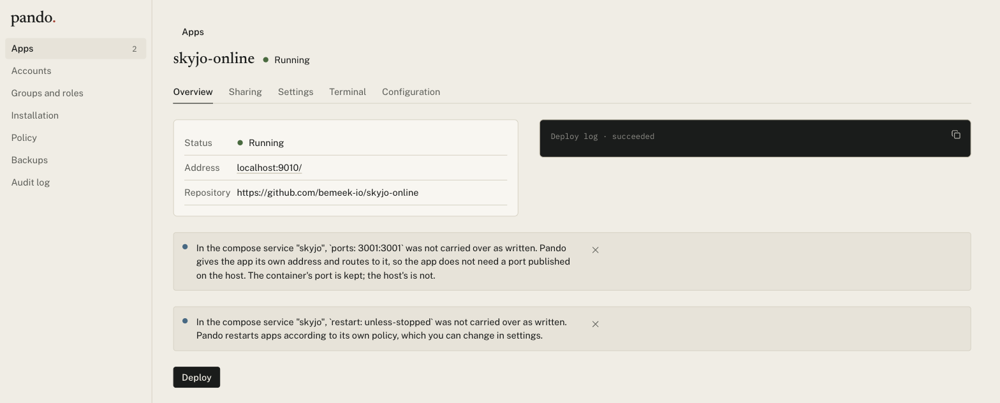

<div align="center">


# Pando

**Deploy and share apps**

[trypando.ai](https://trypando.ai)

[](https://github.com/bemeek-io/pando/actions/workflows/ci.yml)
[](https://codecov.io/gh/bemeek-io/pando)
[](LICENSE)
[](go.mod)
[](https://scorecard.dev/viewer/?uri=github.com/bemeek-io/pando)
[](https://www.bestpractices.dev/projects/14626)

</div>



---

## What is Pando?

Pando is a self-hosted deployment platform. It runs on a machine you control — a laptop, a home
server, a VPS, a server inside a company network — and hosts web applications on it: building them
from a git repository, running them in containers, giving each an address, and deciding who can
reach them.

It is used two ways, and does the same job in both. On your own machine it takes the place of a
hosting provider for side projects and tools you would rather not pay to host. Inside a team or a
company it is one place to run internal applications, with accounts, groups, roles, host policy and
an audit log — and with every app reached through one Pando hostname rather than a public hostname,
certificate and firewall rule per application.

What it does:

- **Deploys from a repository URL.** Pando clones it, works out how the app should be built and run,
  and shows you what it worked out before building anything.
- **Builds five ways**, picked automatically: a Dockerfile, a compose file, an image you already
  publish, a static site, or a buildpack for apps with none of those. Compose files are imported as
  written, including multiple services, healthchecks, volumes and startup order.
- **Puts sign-in in front of every app.** Apps are private by default. Share one with specific people
  or groups, or make it public. Your app receives a signed token describing who is visiting, so it
  does not need its own login.
- **Creates databases on request.** Postgres, MySQL and Redis can be provisioned per app, with
  credentials generated, injected as environment variables, and kept stable across redeploys.
- **Manages secrets, environment variables, volumes and resource limits** per app.
- **Gives you logs, a terminal into a running container, and one-click rollback** to any previous
  configuration.
- **Backs up app storage**, including automatically before an app is deleted.

### For teams and organizations

The same installation, configured rather than upgraded. There is no separate edition and no feature
gating.

- **Accounts, groups and roles.** Permissions are individual verbs in two scopes — what someone can
  do to one app, and what they can do to the installation. The four built-in roles cannot be edited,
  and custom roles are composed from the verb list. Access can be granted to a group as easily as to
  a person, and group membership is read at the moment of the decision rather than copied into
  grants. Accounts are local to the installation in this version.
- **Two separate planes.** Being able to *use* an app and being able to *administer* it are separate
  grants, so somebody who runs an application need not be able to open it, and somebody who uses it
  daily need not be able to change it.
- **Host policy**, set once and enforced everywhere: which sources apps may be deployed from, whether
  apps may be made public, minimum isolation for builds and for runtime, an egress allowlist, whether
  a backup is required before anything is destroyed, a maximum lifetime for API tokens, and verbs
  disabled installation-wide — `app.exec` most often, and separately for automated tokens.
- **An audit log that cannot be rewritten.** Every action is recorded with who did it, and the
  database role Pando runs as holds no `UPDATE` or `DELETE` on that table, so neither Pando nor an
  adapter can alter it after the fact.
- **Isolation between apps.** Each app runs on its own private network and publishes nothing to the
  host. Builds run in a rootless builder with no access to a container runtime socket.
- **One way in.** All traffic reaches applications through Pando's proxy, which authenticates the
  caller and makes the authorization decision. There is no bypass for public apps or for websockets.

## Install

Two pieces, and most people need only the first.

### The server

Requires Docker and Docker Compose. Nothing else — no Go, no Node, no Postgres of your own.

```bash
git clone https://github.com/bemeek-io/pando.git
cd pando
docker compose up -d
```

Pando and Postgres start together. The first run builds the image, which takes a few minutes; after
that it starts in seconds. Open **http://localhost:8080**.

### The CLI

Optional. It is the same binary as the server and talks to an installation over its API, so it goes
on your own machine rather than on the host, and everything it does can also be done in the console.

macOS, and Linux with Homebrew 4.5 or newer:

```bash
brew install bemeek-io/tap/pando
```

Debian and Ubuntu: take a version from the
[releases page](https://github.com/bemeek-io/pando/releases) and download the `.deb` for your
architecture.

```bash
VERSION=0.2.0   # the release you want
curl -LO https://github.com/bemeek-io/pando/releases/download/v${VERSION}/pando_${VERSION}_linux_amd64.deb
sudo apt install ./pando_${VERSION}_linux_amd64.deb
```

The same page has `.rpm` and `.apk` packages, and plain tarballs for macOS and Linux on both
architectures. Every command and flag: [`docs/cli.md`](docs/cli.md). To build it from source
instead:

```bash
go install github.com/bemeek-io/pando/cmd/pando@latest
```

Or skip installing it and use the copy already inside the container, via
`docker compose exec pando pando …`.

### First sign-in

A new installation has no accounts. Open the console and Pando asks you to set up the
administrator: choose a username and password there, and you are signed in.

Whoever reaches the console first sets up the administrator, so do this before anyone else can
reach Pando. To create the account at startup instead, for an unattended install, supply its
password; you are asked to change it when you first sign in:

```bash
# Read only on first run, when there is no account yet.
PANDO_ADMIN_PASSWORD=... docker compose up -d
```

If the administrator's password is lost, reset it from the host. This ends every session for that
account:

```bash
docker compose exec pando pando admin reset-password
```

`pando admin` talks to the database rather than the API, so it works when nobody can sign in.

### Deploying your first app

In the console, choose **Add app** and paste a repository URL. Pando clones it and shows you a
proposal: which build method it chose, which port it thinks the app listens on, which services it
appears to need, and what it is unsure about. Review it and accept. Anything it could not determine
becomes a question rather than a guess.

Apps are reachable on their own port, starting at `http://localhost:9000`, and the address is shown
on the app's page. Twenty ports are published by default; `PANDO_APP_PORT_START` and
`PANDO_APP_PORT_END` change the range.

## Console

`http://localhost:8080`. Two views, depending on your permissions: a page of app tiles for people who
only need to open apps, and an admin interface for people who deploy and configure them.

The admin interface covers apps and their configuration, sharing and access, environment variables
and secrets, host policy, user accounts, groups and roles, backups, the audit log, and a terminal
into any running container.

## CLI

[Installed separately](#the-cli), or used from inside the container with
`docker compose exec pando pando …`.

```bash
pando login https://pando.example.com    # stores an API token for this machine

pando app add https://github.com/you/notes
pando app list
pando app show notes
pando deploy notes                       # or: pando deploy ./local-directory
pando logs notes --follow
pando exec notes -- sh

pando slot set notes database --provision   # let Pando create the database
pando secret set notes STRIPE_KEY
pando grant add notes --user usr_01HQ8…     # give someone access
pando rollback notes                        # to the previous configuration
pando export notes                          # the app's full spec, as JSON
```

Also `pando backup`, `pando policy` and `pando token`. Run `pando <command> --help` for details, and
`--server` to talk to an installation other than the one you logged into. Every command, with its
flags: [`docs/cli.md`](docs/cli.md).

For CI, a container or anything else with no home directory to store a login in, set a token in the
environment instead:

```bash
export PANDO_SERVER=https://pando.example.com
export PANDO_TOKEN=tok_…      # from the console, under API and tools
```

## MCP server

Pando exposes its API to coding agents over MCP, so an agent can deploy and inspect apps directly.
It runs on your machine over stdio and uses the token from `pando login`.

```bash
pando login https://pando.example.com
```

**Claude Code:**

```bash
claude mcp add pando -- pando mcp
```

**Any other MCP client**, in its config file:

```json
{
  "mcpServers": {
    "pando": {
      "command": "pando",
      "args": ["mcp"]
    }
  }
}
```

The tools, with their arguments: [`docs/mcp.md`](docs/mcp.md). An MCP client that runs `pando mcp`
without a login of its own takes `PANDO_SERVER` and `PANDO_TOKEN` from its `env` block.

An agent's token carries the same permissions you do and no more, and everything it does appears in
the audit log under your name. Running commands inside apps, reading secret values and changing who
has access are not available as MCP tools, and are denied to tokens by host policy by default.

## HTTP API

Everything above is a client of `/api/v1`, which you can use directly with a session cookie or a
bearer token from `pando token`. Errors return a machine-readable code, a description, and a
suggested fix:

```json
{
  "code": "PLAN_SLOT_UNFILLED",
  "message": "This app needs a PostgreSQL database, and one hasn't been chosen yet.",
  "remedy": "Choose how to fill the database slot: provision one inside this app, connect to an existing one, or paste a connection string.",
  "details": { "slots": [{ "key": "database", "type": "postgres" }] },
  "request_id": "req_01HQ8…"
}
```

Every endpoint, the verb it asks for and every error code: [`docs/api.md`](docs/api.md) — generated
from the running code, so it cannot describe a version of Pando that no longer exists. The same
document is in the console under **API and tools**, which is also where you mint a token, and at
`GET /api/v1/reference` for anything that would rather read it as JSON.

## Configuration

Set on the `pando` service in `docker-compose.yml`, or in the environment.

| Variable | Default | Purpose |
|---|---|---|
| `PANDO_PORT` | `8080` | Port the console and API are served on. |
| `PANDO_ADMIN_PASSWORD` | generated | Initial admin password. Read only on first run. |
| `PANDO_APP_PORT_START` / `_END` | `9000` / `9019` | Range of host ports apps are given. Sets both what Compose publishes and what Pando allocates. |
| `PANDO_BASE_DOMAIN` | `localtest.me` | Domain per-app subdomains are taken from, when using hostname routing. |
| `PANDO_DATABASE_URL` | the bundled Postgres | Point Pando at an existing database instead. |
| `PANDO_SERVER_EXTERNAL_URL` | — | The address browsers reach Pando on, such as `https://pando.example.com`. Set this whenever something else terminates TLS — it is what marks the session cookie `Secure`. |
| `PANDO_POLICY_<SETTING>` | — | Fixes a host policy setting, such as `PANDO_POLICY_MIN_SECURITY_SCORE=70`. It cannot then be changed in the console. Compose passes only the variables listed on the `pando` service, so add it there. See [the reference](docs/reference.md#host-policy-at-startup). |

## What Pando does not do

It does not schedule across machines: one installation runs apps on its host, and multi-machine
support would come from a runtime adapter that spans machines. It does not run your tests. It is not
an app marketplace, not a disaster-recovery product with RPO/RTO guarantees, not multi-region, and
not multi-tenant — one installation serves one organization.

It reports problems rather than working around them. If an app loads its assets from the domain root
and will break under a path prefix, Pando says so; it does not rewrite the app's pages.

## Documentation

- [`docs/reference.md`](docs/reference.md) — the external interfaces in one place: the HTTP API, what
  an app receives, every configuration variable, and the guarantees worth relying on.
- [`docs/design/04-api.md`](docs/design/04-api.md) — the full API reference.
- [`CHANGELOG.md`](CHANGELOG.md) — what changed in each release, and whether you need to act.

## Reporting a problem

- **A bug**, or something that does not work as documented: [open an
  issue](https://github.com/bemeek-io/pando/issues/new/choose).
- **A security vulnerability**: privately, through [the advisory
  form](https://github.com/bemeek-io/pando/security/advisories/new) — not as an issue. See
  [`SECURITY.md`](SECURITY.md) for what to include and what response to expect.
- **A question**: [Discussions](https://github.com/bemeek-io/pando/discussions).

## Contributing

Bug reports and pull requests are welcome. See [`CONTRIBUTING.md`](CONTRIBUTING.md) for how the
project is organized, how to build it, and what a change needs before it can be merged.
[`CODE_OF_CONDUCT.md`](CODE_OF_CONDUCT.md) applies everywhere the project happens.

## License

AGPL-3.0, with a commercial license available for embedding Pando in a proprietary product or
offering it as a hosted service without publishing modifications. See
[`LICENSING.md`](LICENSING.md) for which applies to you, and [`LICENSE`](LICENSE) for the full text.
